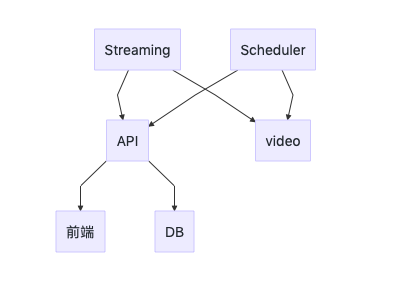

# 流媒体网站

## 整体架构



后端的3个模块是单独的  
* api模块
  * 用户登录、注册、流媒体的CURD、评论
  * Session处理


* scheduler模块
  * Timer定时任务
  *


* stream模块
  * 视频上传
  * 限流


### 用户
```
创建用户 URL: /user POST SC: 201 400 500
用户登录 URL: /user/:username POST SC: 200 400 500
获取用户信息 URL: /user/:username GET SC: 200 400 401 403 500
用户注销 URL: /user/:username DELETE SC: 204 400 401 403 500
```

### 用户资源
```
列出所有视频 URL: /user/:username/videos GET SC: 200 400 500
列出一个视频 URL: /user/:username/videos/:vid-id GET SC: 200 400 500

删除一个视频 URL: /user/:username/videos/:vid-id DELETE SC: 200 400 500
```


### 评论
```
显示评论 URL: /videos/:vid-id/comments 
post a comment: URL: /videos/:vid-id/comments
delete a comment: URL: /videos/:vid-id/comments/:comment-id
```